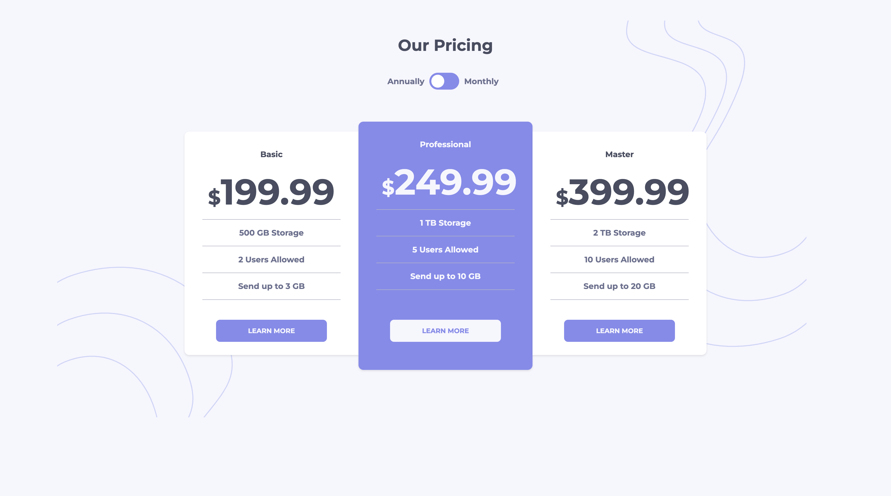

# Frontend Mentor - Pricing component with toggle solution

This is my solution to the [Pricing component with toggle challenge on Frontend Mentor].
## Table of contents

- [Overview](#overview)
  - [The challenge](#the-challenge)
  - [Screenshot](#screenshot)
  - [Links](#links)
- [My process](#my-process)
  - [Built with](#built-with)
  - [What I learned](#what-i-learned)
  - [Continued development](#continued-development)
  - [Useful resources](#useful-resources)
- [Author](#author)
- [Acknowledgments](#acknowledgments)

## Overview

### The challenge

Users should be able to:

- View the optimal layout for the component depending on their device's screen size
- Control the toggle with both their mouse/trackpad and their keyboard

### Screenshot

### Links

- Solution URL: 
- Live Site URL: 

## My process

### Built with

- Semantic HTML5 markup
- CSS custom properties
- Flexbox
- TypeScript
- Mobile-first workflow

## Author

- Name - [Marley_Sande]()
- Frontend Mentor - [@Marley-Semende](https://www.frontendmentor.io/profile/Marley-Semende)
- Twitter - [@noSpagheti_code](https://twitter.com/noSpagheti_code)
